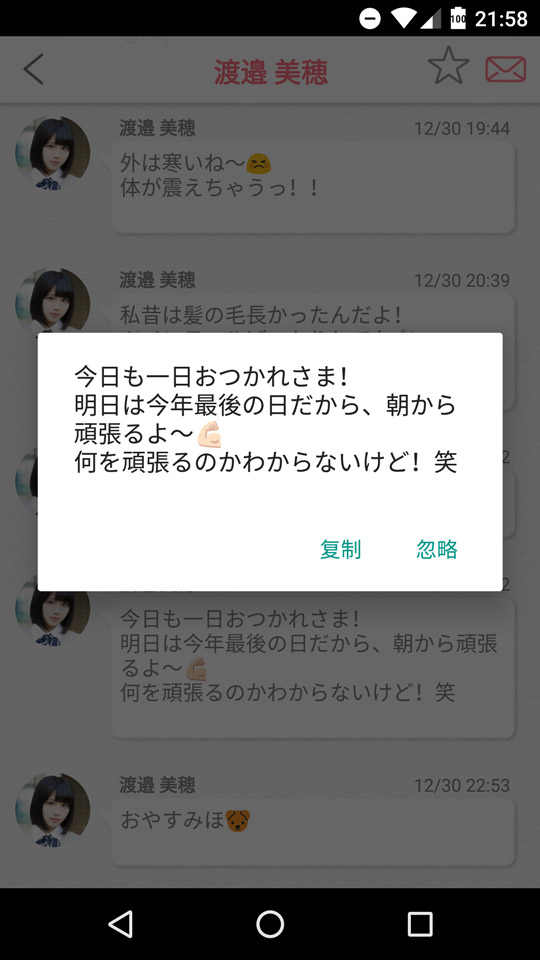
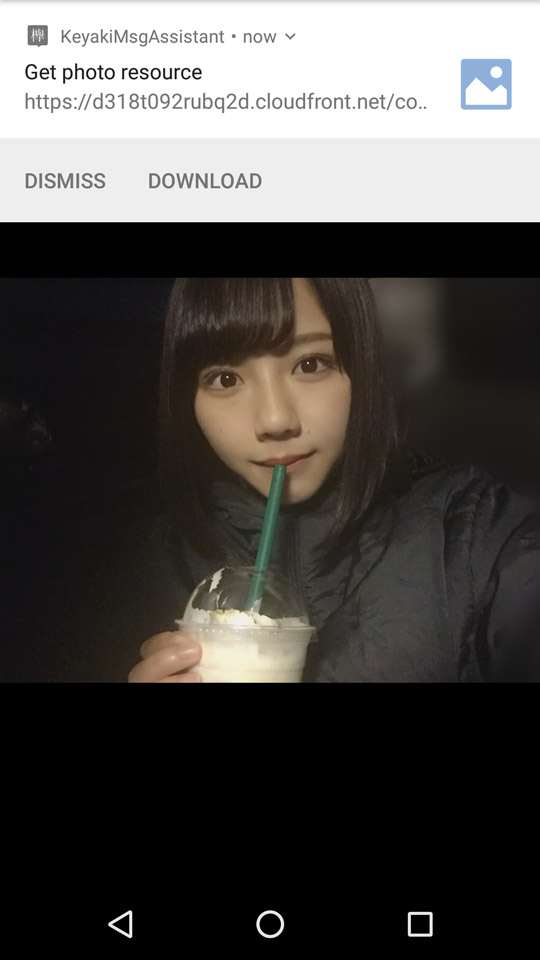
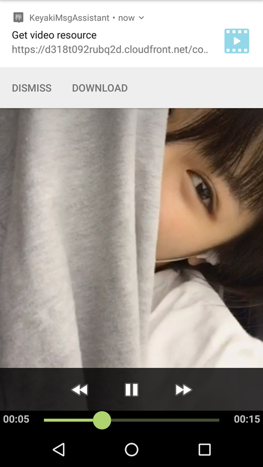
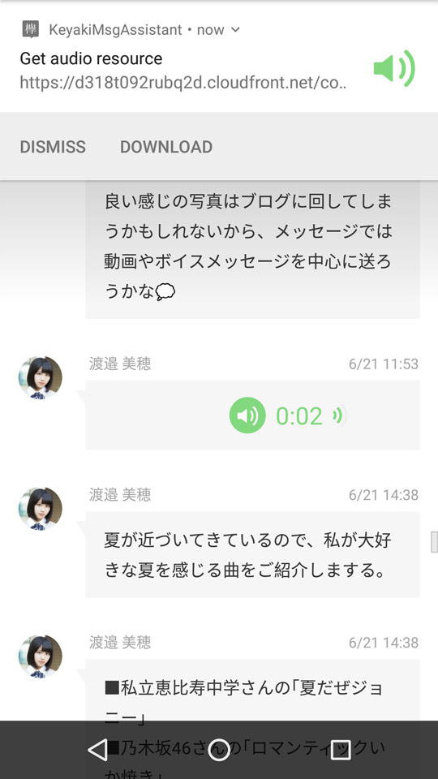

# KeyakiMsgAssistant
Xposed module for "欅坂46メッセー" app  
(Without user interface)

## Requirement
- [x] Android 4.1+
- [x] Rooted
- [x] Xposed framework

## Permission
- INTERNET
- WRITE_EXTERNAL_STORAGE
- SYSTEM_ALERT_WINDOW

## Feature
- Add double-tap-to-copy function for text
- Help to download photos, audios, videos in messages
- Lift the restriction on screenshot and screenrecord

## Screenshot

## Reference

[Ashish-Bansal/OneTapVideoDownload](https://github.com/Ashish-Bansal/OneTapVideoDownload)

[veeti/DisableFlagSecure](https://github.com/veeti/DisableFlagSecure)

## License

This project is under the [GNU General Public License v3.0](https://www.gnu.org/licenses/gpl-3.0.en.html)